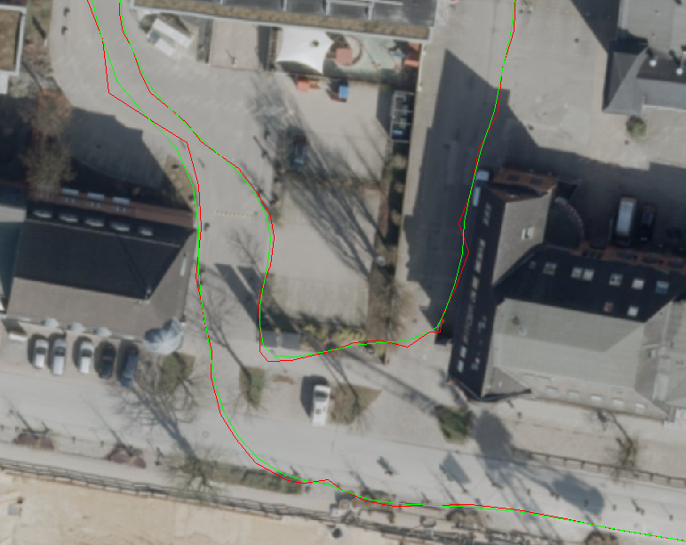

# gpx-smoother
A simple approach to smooth a GPX track without loosing too much accuracy.

# Result


# Algorithm
Currently this takes each point of the track and gets `n` neighbors around it. Then a weighted average of their locations is calculated: Points near by are weighted more than points far away.

```go
 // Basically: How strong is the weight. This is later an exponent.
weightFactor := 3.0

// for each point:

	// for each neighbor of the current point

		// Weight look like: 1 2 3 [4] 3 2 1 (where [4] is the point currently looking at)
		// This is used as basis for "weight^weightFactor"
		weight := stepsBackwards/2 - int(math.Abs(float64(j-i))) + 1

		// sum up the coordinates
		latSum += points[j].Lat * math.Pow(float64(weight), weightFactor)
		lonSum += points[j].Lon * math.Pow(float64(weight), weightFactor)

	// To later get the correct location, we need to know how many locations we used
	weightSum += math.Pow(float64(weight), weightFactor)

// Get the average
newTrkpt[i-stepsBackwards/2] = Trkpt{
	Lat: latSum / weightSum,
	Lon: lonSum / weightSum,
}

```
